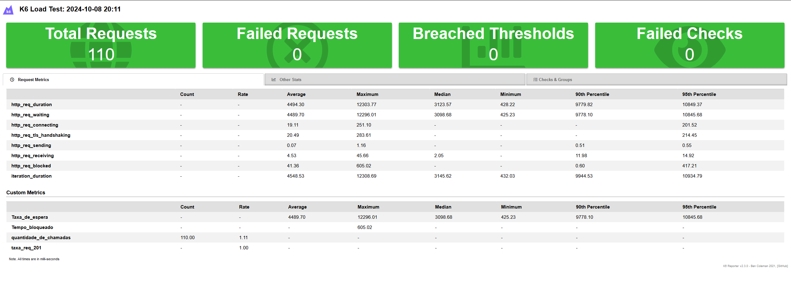
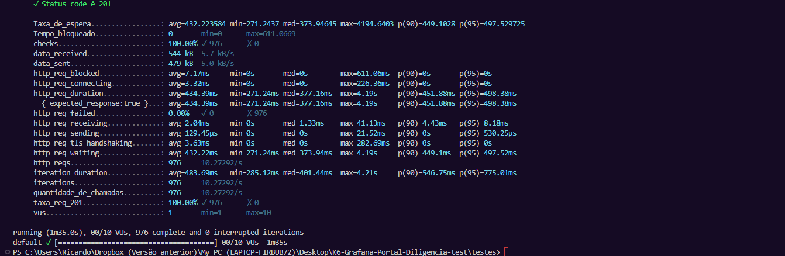

# K6 Load Testing Project

Este projeto utiliza o K6 para realizar testes de performance na API do portal de diligência. O workflow de testes é executado automaticamente usando GitHub Actions, e os resultados são armazenados como artefatos e relatórios.

## Estrutura do Projeto

- **`API_Portal_Diligencia.js`**: Script de teste principal, que contém a lógica para enviar requisições POST para a API da diligência e monitora métricas de performance como tempo de espera, taxa de requisições bem-sucedidas e quantidade de chamadas.
- **`config.js`**: Arquivo de configuração onde são definidos a `baseUrl` da API e os `headers` necessários, incluindo o token de autenticação.
- **`payloads.js`**: Gera o payload com dados de teste, como nome, ano, prazo e outros detalhes.
- **`post-load-test-report.html`**: Relatório gerado automaticamente pelo K6 após os testes de carga.

## Pré-requisitos

- [K6](https://k6.io/) deve estar instalado para executar os testes localmente.
- A API do portal de diligência deve estar acessível e configurada corretamente.
- Token de autenticação para acessar a API, definido no arquivo `config.js`.

## Como Executar Localmente

1. Instale o K6:
   ```bash
   sudo apt-get update
   sudo apt-get install -y k6

## Acessar a pasta "tests" e Execute os testes:

    k6 run load_test_Portal_Diligencia.js

## Imagem Relatório de Execução

  Aqui está um exemplo de relatório gerado após a execução dos testes:

  

## rodando na nuvem (K6 Cloud)
   
     k6 cloud load_test_Portal_Diligencia.js

## Imagem Relatório de Execução

  Aqui está um exemplo de relatório no Grafana gerado após a execução dos testes:

  

## Imagem Relatório de Execução

  Aqui está um exemplo de relatório via prompt comando gerado após a execução dos testes:

  

Faz o checkout do código.
    Instala o K6.
    Executa o script de teste.
    Carrega os resultados como artefatos, se bem-sucedido.

## Relatórios de Performance k6

Os relatórios de desempenho são gerados após a execução dos testes e podem ser visualizados diretamente como arquivos HTML. Você pode encontrar os relatórios na pasta results/k6-results/ ou baixá-los como artefatos do GitHub Actions.
Métricas Monitoradas

    Quantidade de Chamadas (MyCounter): Quantidade de chamadas realizadas durante o teste.
    Tempo Bloqueado (myGauge): Tempo que a requisição ficou bloqueada.
    Taxa de Sucesso 201 (myRate): Taxa de requisições que receberam status 201 (Criado).
    Taxa de Espera (myTrend): Tempo de espera durante o teste.

## Configuração do Script

O script API_Portal_Diligencia.js envia requisições para a API com um payload gerado aleatoriamente para simular diferentes entradas.
Exemplo de Payload
```java
{
    "nome": "portal diligência",
    "ano": "2024",
    "mesreferencia": "12",
    "prazo": "2024-10-20",
    "procedente_cod_funcionario": "3113",
    "principal_ug": {
        "ent_codigo": 4,
        "nome": "Santa Denise do Leste",
        "municipio_codigo": 25
    }
}
```
## Contribuição

Contribuições são bem-vindas! Sinta-se à vontade para abrir issues ou pull requests.
